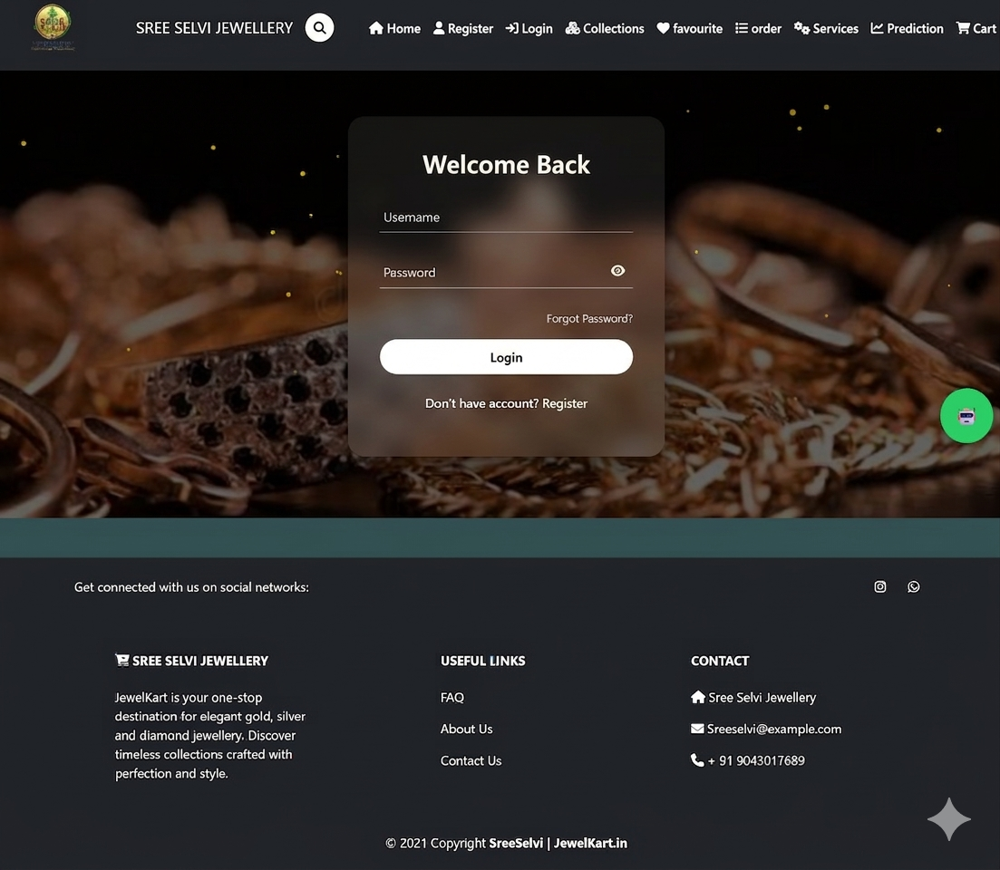
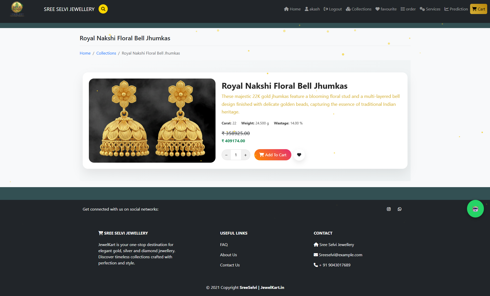
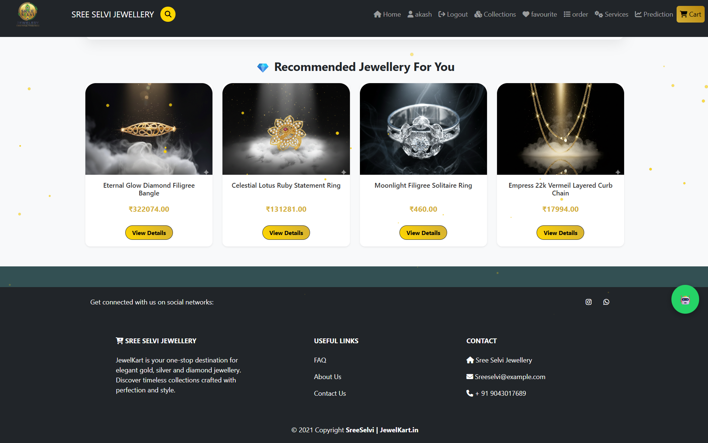
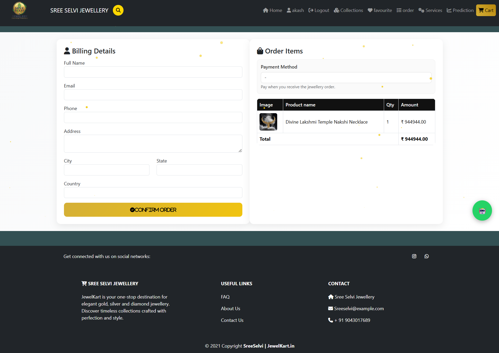
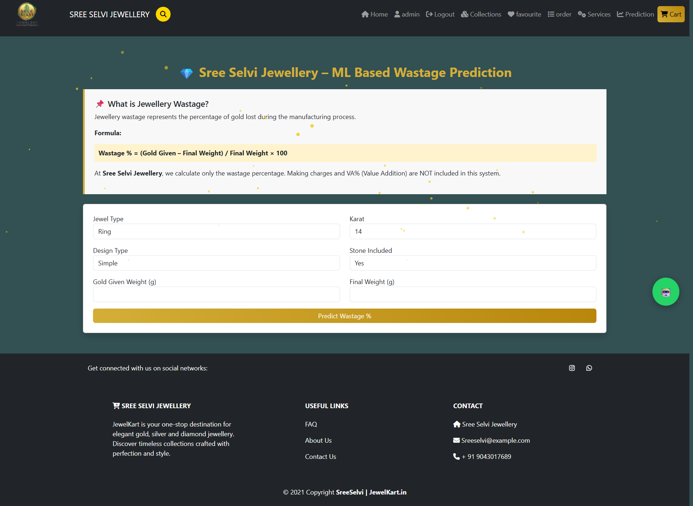

# 💎 Smart Jewellery E-Commerce Website with AI Recommendation System

## 📌 Project Overview

Smart Jewellery is an AI-powered e-commerce platform designed to enhance the online jewellery shopping experience. The platform allows customers to browse, search, and purchase jewellery products while receiving intelligent product recommendations based on their preferences and browsing behavior.

The system combines modern web technologies with Artificial Intelligence to provide personalized suggestions, improving customer engagement and shopping satisfaction.

---

## 🚀 Features

### 🛍️ E-Commerce Functionality

* User Registration and Authentication
* Product Catalog Management
* Advanced Product Search
* Product Categories and Filtering
* Shopping Cart Management
* Secure Checkout Process
* Order Management System
* User Profile Management

### 🤖 AI Recommendation System

* Personalized Jewellery Recommendations
* Preference-Based Product Suggestions
* Intelligent Product Matching
* Customer Behavior Analysis
* Trending Product Recommendations

### 📊 Admin Features

* Product Management
* Inventory Tracking
* Order Monitoring
* Customer Management
* Sales Analytics Dashboard

---

## 🛠️ Technology Stack

### Frontend

* HTML5
* CSS3
* JavaScript
* Bootstrap

### Backend

* Django Framework
* Python

### Database

* MySQL

### AI & Machine Learning

* Python Libraries
* Recommendation Algorithms

### Deployment

* GitHub
* Vercel

---

## 📂 Project Structure

```text
Smart-Jewellery/
│
├── manage.py
├── requirements.txt
├── vercel.json
├── static/
├── templates/
├── media/
├── products/
├── users/
├── recommendations/
└── project/
    ├── settings.py
    ├── urls.py
    └── wsgi.py
```

## ⚙️ Installation


### Navigate to Project

```bash
cd Smart-Jewellery-E-Commerce-Website-and-AI-Recommendations-System-
```

### Create Virtual Environment

```bash
python -m venv venv
```

### Activate Virtual Environment

```bash
venv\Scripts\activate
```

### Install Dependencies

```bash
pip install -r requirements.txt
```

### Run Server

```bash
python manage.py runserver
```

---

## 🎯 Future Enhancements

* AI-Based Virtual Jewellery Try-On
* Voice Search Functionality
* Real-Time Product Recommendations
* Payment Gateway Integration
* Customer Review Sentiment Analysis
* Mobile Application Development

---

## 📈 Project Objectives

* Improve online jewellery shopping experience.
* Deliver personalized product recommendations.
* Increase customer engagement and conversion rates.
* Apply AI techniques in real-world e-commerce applications.

---

## 👨‍💻 Author

**Srinivas**

Aspiring Python Developer | Django Developer | Data Analytics Enthusiast

GitHub Repository:
https://github.com/aravinth-developer/Smart-Jewellery-E-Commerce-Website-and-AI-Recommendations-System-

---

## 📄 License

This project is developed for educational and learning purposes.

---

## 📸 Project Screenshots

### 🏠 Home Page

.png)

---

### 🔐 Login Page



---

### 📝 Registration Page


---

### 💍 Jewellery Collections

.png)

---

### ✨ Product Details



---

### 🤖 AI Jewellery Recommendations



---

### 🛒 Shopping Cart

.png)

---

### 💳 Order Summary



---

### 📈 ML-Based Wastage Prediction

